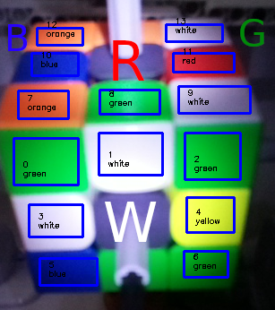

<table style="width: 100%; border-collapse: collapse; border: none;">
    <tr>
        <td style="text-align: center; vertical-align: middle;">
            <video src='files/VideoDemonstration.mp4' controls loop autoplay style="max-width: 45vw; max-height: 80vh;"></video>
            https://github.com/jonas-kell/mz-cube-robot/blob/master/files/VideoDemonstration.mp4
        </td>
        <td style="text-align: center; vertical-align: middle;">
            
        </td>
    </tr>
</table>
  
Installation:

Python extension,

Ev3 extension,
https://marketplace.visualstudio.com/items?itemName=ev3dev.ev3dev-browser

```cmd
python3 -m venv .venv
source .venv/bin/activate

pip install --upgrade pip
pip install --upgrade python-ev3dev2
pip install --upgrade pyusb
pip install --upgrade opencv-python
pip install --upgrade scikit-image
pip install --upgrade RubikTwoPhase

------ to deactivate
deactivate
```

SSH onto pi: default user: `pi`, pw: `pi`
SSH onto ev3: default user: `robot`, pw: `maker`

```cmd
ssh -o PasswordAuthentication=yes -o PreferredAuthentications=keyboard-interactive,password -o PubkeyAuthentication=no pi@192.168.1.1

    ssh -o PasswordAuthentication=yes -o PreferredAuthentications=keyboard-interactive,password -o PubkeyAuthentication=no robot@10.42.0.3

        sudo python3 ~/mz-cube-robot/ev3-server.py # enter pw
        nohup sudo python3 ~/mz-cube-robot/ev3-server.py &

        exit

    ssh -o PasswordAuthentication=yes -o PreferredAuthentications=keyboard-interactive,password -o PubkeyAuthentication=no robot@10.42.1.3

        sudo python3 ~/mz-cube-robot/ev3-server.py # enter pw
        nohup sudo python3 ~/mz-cube-robot/ev3-server.py &

        exit

    sudo python3 ~/mz-cube-robot/rpi-server.py
    nohup sudo python3 ~/mz-cube-robot/rpi-server.py &
```
