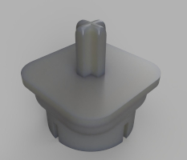

# Mathezirkel-Cube-Solving-Robot

https://github.com/user-attachments/assets/eca1f05e-32c8-4683-82ac-e17c1d3a330d

<table style="width: 100%; border-collapse: collapse; border: none;">
    <tr>
        <td style="text-align: center; vertical-align: middle;">
            <video src='files/VideoDemonstration.mp4' controls loop autoplay style="max-width: 45vw; max-height: 80vh;"></video>
        </td>
        <td style="text-align: center; vertical-align: middle;">
            
        </td>
    </tr>
</table>
  
## What is this

This is a Project, undertaken first at the `Mathecamp` of the `University of Augsburg` 2024.
The idea is to

-   Develop a Robot from scratch, that can solve the `Rubics-Cube` without external inputs
-   Make this experience as teachable as possible for young students, that might or might not have been working with robotics/coding yet

## How is this realized

A first version was made to work in September 2024. Videos of the Rsults can be seen above ([or HERE](https://github.com/user-attachments/assets/eca1f05e-32c8-4683-82ac-e17c1d3a330d)).

The code that is needed to get this working is fully contained in this repository.

The Hardware-Setup however is NOT contained here. Though the video can be taken as reference.

There is a list of materials and how to do the basic setup [here](/setup-configuration/bill-of-materials.md).

Basically, he robot is comprised of a `Raspberry-Pi Zero W` with a camera module.
It provides the stream of the camera view over a simple webserver.
It also relays motor commands to two `Lego Ev3` bricks, that control in total 6 motors, one for each face of the cube.

The `Raspberry-Pi Zero W` has its Wireless capabilities configured as an access point.
One can then connect to that access point and run code one ones own Laptop that processes the camera stream and issues the rotation commands, until the cube is solved.

## What to find in this repository

-   [Bill of Materials](setup-configuration/bill-of-materials.md)
-   [Hardware configuration](setup-configuration/hardware-configuration.md)
-   [Installation instructions](setup-configuration/installation-instructions.md)
-   [Startup instructions for when everything is installed](setup-configuration/startup.md)
-   [Server code to run on the Raspberry Pi](rpi-server.py)
-   [Server code to run on the EV3s](ev3-server.py)
-   [A possible set of processing and issuing functions](solving-example-code/)

## Gallery

The photos are also found at their respective locations in the sub-modules of the explanation above.

<table style="width: 100%; border-collapse: collapse; border: none;">
    <tr>
        <td style="text-align: center; vertical-align: middle;">
            
        </td>
        <td style="text-align: center; vertical-align: middle;">
            
        </td>
    </tr>
</table>
<table style="width: 100%; border-collapse: collapse; border: none;">
    <tr>
        <td style="text-align: center; vertical-align: middle;">
            
        </td>
    </tr>
</table>
<table style="width: 100%; border-collapse: collapse; border: none;">
    <tr>
        <td style="text-align: center; vertical-align: middle;">
            
        </td>
        <td style="text-align: center; vertical-align: middle;">
            
        </td>
    </tr>
</table>
