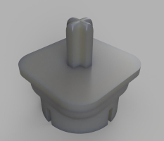

# Bill of Materials

What is required to reproduce this setup

-   Two `Lego EV3` ([Discontinued](https://www.lego.com/de-lu/product/lego-mindstorms-ev3-31313), go to ebay)
    -   Six Motors (When you have two EV3, you get 4 large and 2 small motors. The small ones have a different speed though. I happen to have 6 `Lego NXT 2.0 - Motors`).
-   One `Raspberry Pi Zero W` (Zero 2 probably also works and is more performant) [Like this](https://www.reichelt.de/raspberry-pi-zero-w-v-1-1-1-ghz-512-mb-ram-wlan-bt-rasp-pi-zero-w-p256438.html)
    -   `Camera Module` for the Raspberry Pi [Like this](https://www.reichelt.de/raspberry-pi-kamera-8mp-67-v2-rasp-cam-2-p170853.html)
    -   `Pi Zero compatible Adapter Flex Cable` (smaller pins on one side!!) [Like this](https://www.reichelt.de/raspberry-pi-zero-flexkabel-fuer-standard-kameramodul-15cm-rpiz-cam-fl15-p223615.html)
-   Three `16 Gb Micro-SD-Cards` (One for the RPi, one for each of the two EV3)
-   One `Micro USB to USB-A female Adapter` ([Like this](https://www.reichelt.de/de/de/raspberry-pi-kabel-micro-usb-m-auf-usb-typ-a-f-otg-10cm--rpi-usb-b-a-1-wt-p316284.html))
-   One `USB-A USB-Hub` (ideally powered) ([Like this](https://www.reichelt.de/usb-2-0-4-port-hub-4x-a-equip-128955-p311104.html))
-   One `Micro USB to USB-A cable` to power the Raspberry Pi ([Like this](https://www.reichelt.de/usb-2-0-kabel-a-stecker-auf-micro-b-stecker-3-m-shvp-77183-w-p211162.html))
    -   USB-A power brick (Basically any does) ([Like this](https://www.reichelt.de/usb-ladegeraet-5-v-1000-ma-schwarz-goobay-44947-p265655.html))
-   For the LED-Lighting
    -   2x (or more) White LEDs ([Like these](https://www.reichelt.de/led-5-mm-bedrahtet-kaltweiss-18000-mcd-15--led-5-18000-ws-p76715.html))
    -   Cables to solder and connect ([Like these](https://www.reichelt.de/entwicklerboards-steckbrueckenkabel-40-pole-m-m-40-cm-debo-kabelset22-p340347.html))
    -   2x 100 Ohm Resistor (To avoid burning out the LED, when connected to 5V of Pi Zero, [LED Calculator](https://www.digikey.de/de/resources/conversion-calculators/conversion-calculator-led-series-resistor)) ([Like these](https://www.reichelt.de/widerstand-metalloxyd-100-ohm-0207-1-0-w-5--1w-100-p1777.html))
-   If you want to power the `Lego EV3` over Wall power (not feed it 100s of batteries)
    -   Wall power supply, that does 9-10V ([Like this](https://www.amazon.de/dp/B0CCV95BSF))
    -   Alligator Clips ([Like these](https://www.amazon.de/dp/B0D7V5G3WT))
    -   4 Batteries, Tinfoil
    -   Some wire parts, pliers, soldering iron and stuff for connecting them
-   A Rubics-Cube that can have the center caps removed ([This one probably fits the printed adapters](https://speedcubeshop.com/products/moyu-rs3-m-2020-3x3-magnetic))

    -   6 Adapters to connect the YOUR Rubics-Cube centers to Lego-Axles (3d-Printing required or other alternative you fancy, e.g. some hardening putty or what do I know)
    -   [.stl File of the Adapter Model used](./../files/CubeAdapter.stl). Thanks to [@jangeiger](https://github.com/jangeiger) for designing and printing :-)

         &nbsp;&nbsp;&nbsp;&nbsp;&nbsp;&nbsp;&nbsp;&nbsp;&nbsp; 

## Legacy/Alternatives

this project was initially envisioned to be working with one `Lego EV3` and one `Lego NXT 2.0`.
Alternatively two `Lego NXT 2.0`.

The problem is, that one of either `Lego EV3` or `Lego NXT 2.0` doesn't have enough motor-ports for controlling 6 motors.

There is a non-complete version for using `Lego NXT 2.0`.
For one, an old version of the server scripts can be found in the history: [COMMIT](https://github.com/jonas-kell/mz-cube-robot/blob/22c137ebf0f76d9267865a2a87c0837d4efc5210/rpi-server.py).

Also configuration files and other resources are in [this legacy folder](../testing-preparation-setup/nxt-slave/).

This was scrapped due to not solvable motor precision errors when using `Lego NXT 2.0`.
